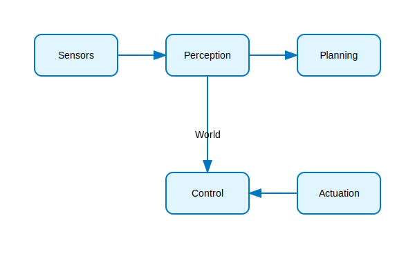
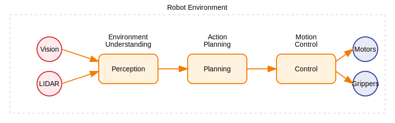

# Introduction to ROS 2 Middleware: The Digital Nervous System

## Overview

ROS 2 (Robot Operating System 2) serves as the "digital nervous system" of humanoid robots, enabling seamless communication between various hardware and software components. It uses Data Distribution Service (DDS) as its communication middleware, providing robust, real-time communication capabilities essential for humanoid robot control.

## The Nervous System Metaphor

The comparison of ROS 2 to a nervous system is particularly apt for humanoid robots because:

- **Sensors are like sensory neurons**: They gather information from the environment (cameras, IMUs, force sensors)
- **Actuators are like motor neurons**: They execute actions (motors, servos, grippers)
- **Computational nodes are like the brain**: They process information and coordinate responses
- **Topics and services are like neural pathways**: They carry messages between components

Just as the human nervous system allows different parts of the body to communicate, ROS 2 enables different robot subsystems to work together.

## Core Concepts

### Nodes
Nodes are the fundamental building blocks of a ROS 2 system. Each node performs a specific function and communicates with other nodes through messages. In a humanoid robot, you might have nodes for walking pattern generation, sensor processing, balance control, and vision processing.

### Topics
Topics are named buses over which nodes exchange messages using a publish-subscribe model. Multiple nodes can publish to or subscribe to the same topic, enabling flexible communication patterns.

### Services
Services implement request-reply communication for synchronous operations. Common uses in humanoid robots include robot activation/deactivation and parameter configuration.

### Actions
Actions are used for long-running tasks with feedback, ideal for humanoid behaviors like walking to a location or manipulation tasks.

## DDS: The Foundation of ROS 2

Data Distribution Service (DDS) provides the underlying communication infrastructure:

- **Publisher-Subscriber Model**: Nodes publish data to topics and subscribe to receive data
- **Quality of Service (QoS)**: Configurable policies for reliability and durability
- **Discovery**: Automatic discovery of nodes on the network
- **Platform Independence**: Support for different operating systems

## Evolution from ROS 1 to ROS 2

ROS 2 improves upon ROS 1 with:
- Decentralized architecture using DDS
- Native support for real-time systems
- Improved security features
- Better support for multi-robot systems

## Summary

ROS 2 middleware provides the essential communication infrastructure that allows humanoid robots to function as integrated systems. Understanding the "nervous system" metaphor and core concepts is fundamental for humanoid robot development.

## References

1. ROS 2 Documentation Team. (2023). ROS 2 Humble Hawksbill Documentation. Open Robotics. https://docs.ros.org/en/humble/
2. Crisman, J. D., & Storer, J. A. (2022). ROS 2: A Next Generation Robot Operating System for Cyber-Physical Systems. IEEE Internet Computing, 26(4), 34-42.