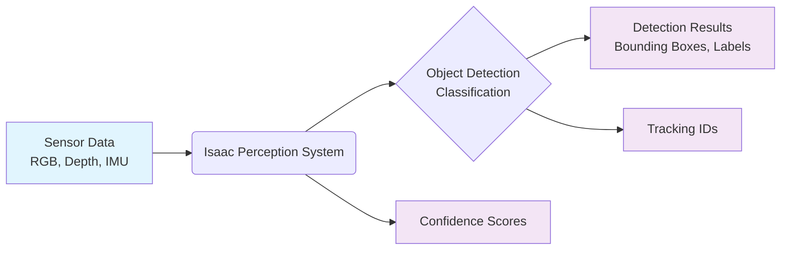
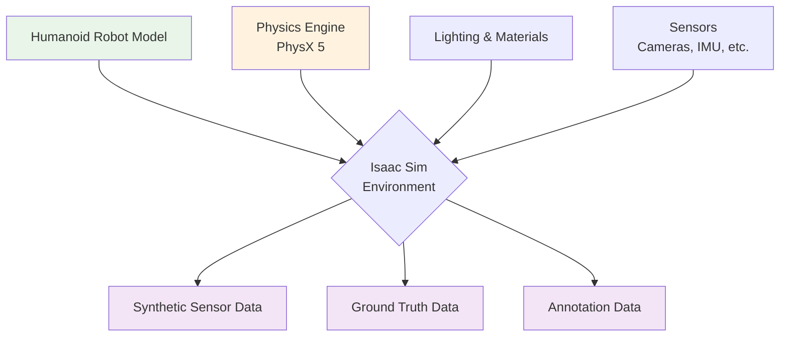
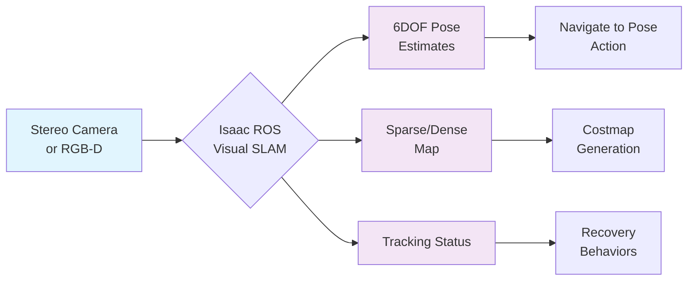
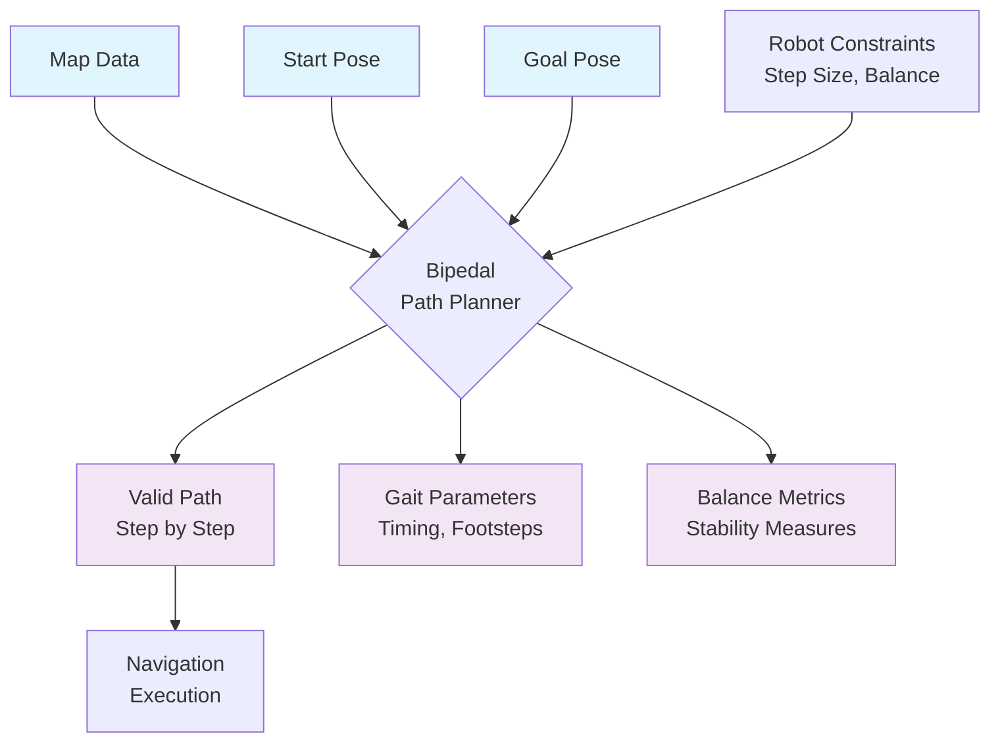
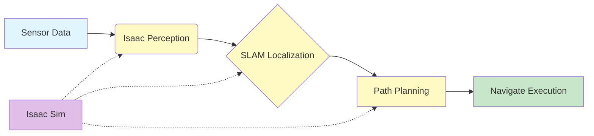
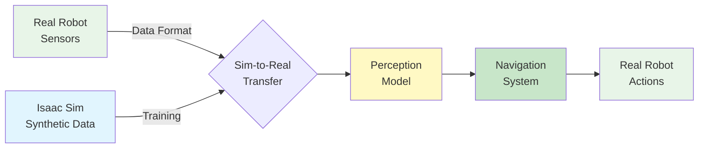

# Isaac Architecture Diagram Templates

This document provides reusable diagram templates for the Isaac module documentation. These templates can be used to create consistent visualizations throughout the chapters.

## 1. Isaac Perception Pipeline

## 2. Isaac Sim Environment Architecture

## 3. Isaac ROS VSLAM Architecture

## 4. Bipedal Path Planning Integration

## 5. Complete Isaac Integration Pipeline

## 6. Simulation-to-Reality Transfer

## Usage Instructions

1. Copy the desired diagram template into your chapter document
2. Customize the labels and descriptions as needed for your specific content
3. Ensure the diagram aligns with the technical concepts being explained
4. Use consistent color coding across all diagrams in the module